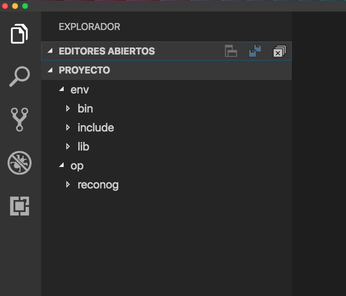

# Reconocimiento-facial-en-Python3-y-OpenCV


> _En la actualidad la tecnologia representa un constante crecimiento en las diversas áreas de nuestras vidas, prácticamente todo aquello que solíamos hacer mediante un grupo de personas o herramienta física, se esta viendo reemplazada por un software o pieza de hardware cada vez mas potente, que "facilita" de cierta forma las tareas cotidianas._

_Algunas acotaciones antes de clonar el proyecto._ 🚀

- Este proyecto esta hecho en python 3.7.3 y opencv 3.4.2.16
- Con haarcascade_frontalface_default.xml
- Se recomienda trabajar en un entorno Virtual.
- Este programa esta compilado en MacOs no tendria problemas en GNU Linux, no se compilo en Windows.
- Se utlizo el herramientas de edicion de texto. (Algunos por aqui 👇 ).

                        **En los requimientos le dejare los repositorios directos.**

## Herramientas 🛠️:


_Aqui los links de descarga de el Editor de Texto preferido, segun su Sistem Operativo._

* [VisualCode](https://code.visualstudio.com/download) - Free. Built on open source. Runs everywhere.
* [Brackets](http://brackets.io) -  A modern, open source text editor that understands web design.
* [Atom](https://atom.io/) - A hackable text editor for the 21st Century.

_OpenCV: Open Source Computer Vision Library._

* [Haarcascades](https://github.com/STR4rGaMes/opencv/tree/master/data/haarcascades) - some attempts to tune the performance.


## Requerimientos para el Entorno Virtual:

  _Para instalar un entorno virtual._
  
  Mas imformacion https://medium.com/@m.monroyc22/configurar-entorno-virtual-python-a860e820aace.
  
```console

    MacBook-Pro-de-User:~ user$ sudo easy_install pip
  
    MacBook-Pro-de-User:~ user$ pip install virtualenv
```

## Pasos para ejecutar la aplicacion:

- Aqui tendremos todo el proyecto, tambien las librerias que utilizaremos en nuestro proyecto.

```console
    #Crear una carpeta donde contendra nuestro entorno virtual y nuestro proyecto.
MacBook-Pro-de-User:Desktop user$ mkdir Proyecto

    #Ingresar a la carpeta creada
MacBook-Pro-de-User:Desktop user$ cd Proyecto

    #Aqui deben direccionar a la carpeta donde se creara el entorno virtorno virtual. 
MacBook-Pro-de-User:Proyecto user$ virtualenv nombre_de_tu_entorno -p python3
  
    #Con este comando se activa el entorno virtual Si desean desactivarlo **deactivate**.
MacBook-Pro-de-User:Proyecto user$ source nombre_entorno_virtual/bin/activate 
```

- Asi tendria que estar nuestro entorno virtual👆
  Ejemplo:
  ```
    proyecto/
      env/ --> Nombre del entorno virtual
        bin/
        include/
        lib/

   ```     
  
- Clonamos el repositorio dentro del virtualenv.

  ```
   proyecto/
      op/
        reconog/
      env/
        bin/
        include/
        lib/
   ```     

- Seguido 



  _Para la ejecucion del programa._

```python
    pip install opencv-python==3.4.2.16
  
    pip install pillow

    pip install numpy
  
    pip install opencv-contrib-python==3.4.2.16
  
```


## Si tienen estos errores comunes tambien los tuve yo:

_error 1

```python


(xx) (base) MacBook-Pro-de-User:rec user$ python3 02.py
Traceback (most recent call last):
  File "02.py", line 11, in <module>
    recognizer = cv2.face.LBPHFaceRecognizer_create()
AttributeError: module 'cv2.cv2' has no attribute 'face'

#solucion 1:

MacBook-Pro-de-User:rec user$ pip install opencv-contrib-python==3.4.2.16

```
_error2 :

```python


cuando no encuentra el archivo DS_

#solucion 2:
borrar la carpeta o crear otra otra vez, denuevo puede causar conflicto: 
  -Data set y Trainer.
  
```
  
  
  
  
  # UNIVERSIDAD NACIONAL DE MOQUEGUA #
  


